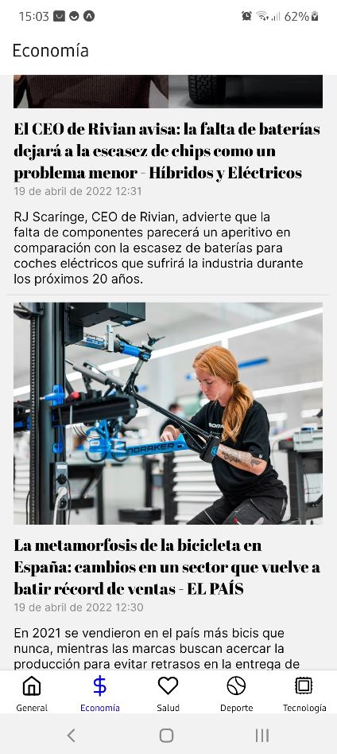
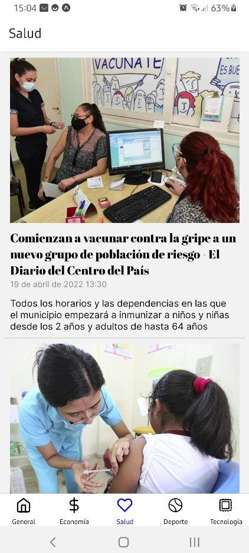

# React Native News App

Practicing with React and News API https://newsapi.org/
 #### ⚠️ UNDER DEVELOPMENT AND FOR EDUCATIONAL PURPOSES ONLY!


# React Native News App

Practicing with React and News API https://newsapi.org/ to create a feed of news using this backend. 
The objetive is not to make a difficult App, is to use React Native Library & some dependencies like icons, fonts & navigations.

The API calls used are `https://newsapi.org/v2/top-headlines` with the parameters `country` & `language`

## Example of what data retrieves this API:

```javascript
{
   "status":"ok",
   "totalResults":9414,
   "-""articles":[
      "-"{
         "-""source":{
            "id":"newsweek",
            "name":"Newsweek"
         },
         "author":"Tinglong Dai and Christopher S. Tang",
         "title":"It's the End of the Global Supply Chain as We Know It | Opinion",
         "description":"Developing both global and regional supply chains can mitigate their supply chain risks drastically.",
         "url":"https://www.newsweek.com/its-end-global-supply-chain-we-know-it-opinion-1698591",
         "urlToImage":"https://d.newsweek.com/en/full/2021647/supply-chain-crisis.jpg",
         "publishedAt":"2022-04-19T12:00:02Z",
         "content":"What a difference a year makes. The U.S. inflation rate was at 1.4 percent when Joe Biden was sworn in as President in January 2021. In just fifteen months, it has since risen rapidly to a 40-year hi… [+5727 chars]"
      },
      "-"{
         "-""source":{
            "id":null,
            "name":"Jezebel"
         },
         "author":"Emily Leibert",
         "title":"The Plight of the Crypto Hottie",
         "description":"There’s a surprising number of bikinis in this particular corner of the internet. Snapshots of silk robes cinched around tiny waists are nestled between dollar signs and rocket ship emojis. You’ll find cleavage of the tasteful and brazen varieties, and mirror…",
         "url":"https://jezebel.com/crypto-hotties-twitter-selfies-empowerment-1848806154",
         "urlToImage":"https://i.kinja-img.com/gawker-media/image/upload/c_fill,f_auto,fl_progressive,g_center,h_675,pg_1,q_80,w_1200/eda4eb1db0598c808fbb9b33934be947.png",
         "publishedAt":"2022-04-19T12:00:00Z",
         "content":"Theres a surprising number of bikinis in this particular corner of the internet. Snapshots of silk robes cinched around tiny waists are nestled between dollar signs and rocket ship emojis. Youll find… [+20620 chars]"
      },
      "-"{
         "-""source":{
            "id":null,
            "name":"CNA"
         },
         "author":null,
         "title":"Tesla's Shanghai factory resumes production - Chinese local media",
         "description":"SHANGHAI :     Tesla Inc resumed production at its Shanghai plant on Tuesday following a three-week stoppage, Chinese local media reported.8,000 employees at the plant reported to work, the report said.",
         "url":"https://www.channelnewsasia.com/business/teslas-shanghai-factory-resumes-production-chinese-local-media-2633946",
         "urlToImage":"https://onecms-res.cloudinary.com/image/upload/s--l0BEcsbj--/fl_relative,g_south_east,l_one-cms:core:watermark:reuters,w_0.1/f_auto,q_auto/c_fill,g_auto,h_676,w_1200/v1/one-cms/core/2022-04-19t115917z_1_lynxnpei3i0fm_rtroptp_3_tesla-china-eve-energy.jpg?itok=f_7Rd2f8",
         "publishedAt":"2022-04-19T11:59:17Z",
         "content":"We know it's a hassle to switch browsers but we want your experience with CNA to be fast, secure and the best it can possibly be.\r\nTo continue, upgrade to a supported browser or, for the finest exper… [+30 chars]"
      }
   ]
}
```
## Example of categories


